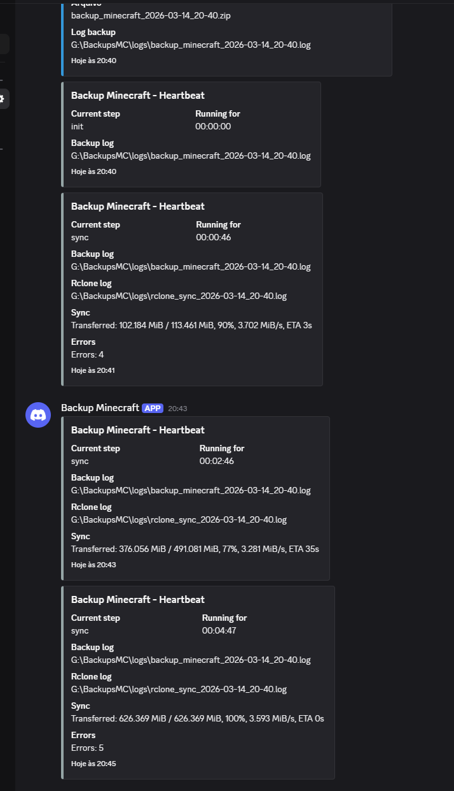
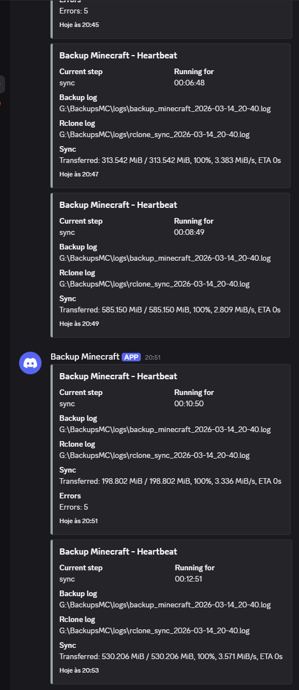
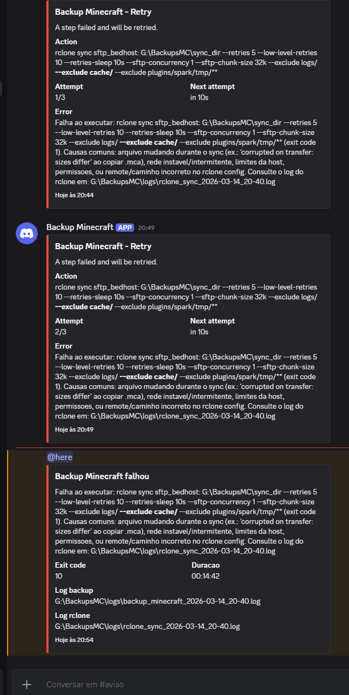
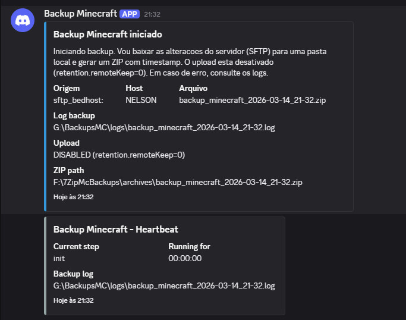
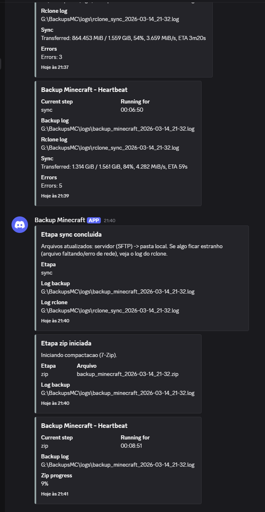
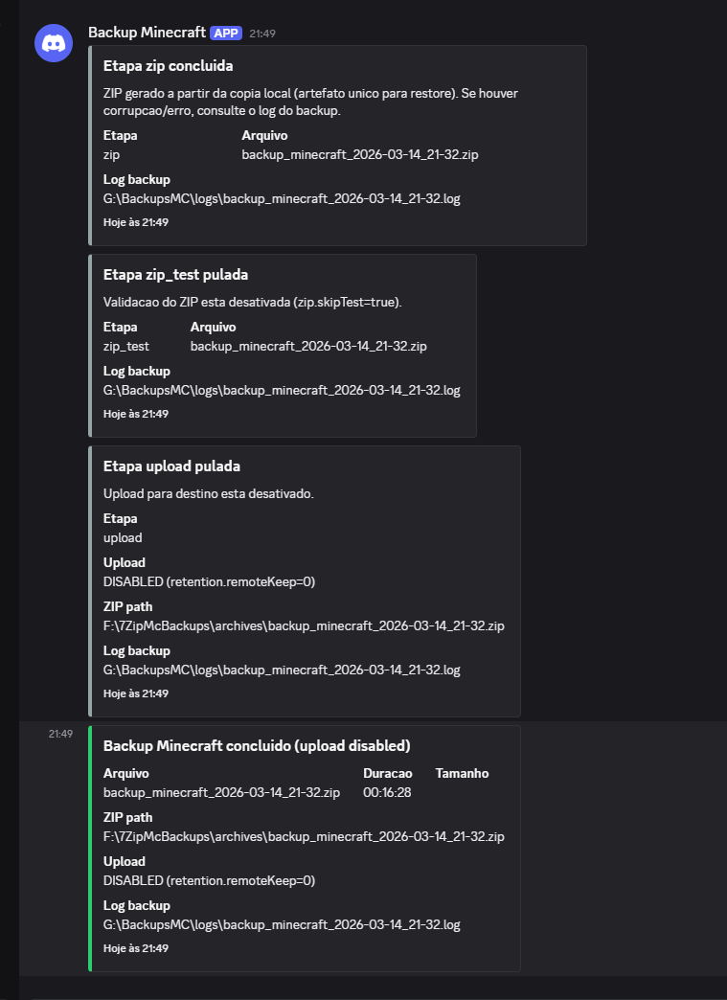

# 🧰 Backup Minecraft (SFTP -> ZIP -> Destino via rclone)

Este repositório/arquivo contém um script PowerShell (`backup-mc.ps1`) para:

- Baixar (sincronizar) o mundo do Minecraft via SFTP para uma pasta local.
- Compactar tudo em um `.zip`.
- Enviar o `.zip` para um destino configurado no `config.json` (via `rclone` ou pasta local).
- Manter apenas os **7 backups mais recentes** no remoto (rotação).

## 📌 Índice

- [Por que esse script existe](#por-que-esse-script-existe)
- [Requisitos](#requisitos)
- [Configuração (`config.json`)](#configuracao-config-json)
  - [Notificações no Discord (Webhook)](#discord-webhook)
  - [Compressão do ZIP (7-Zip)](#zip-7-zip)
  - [Retenção (quantas cópias manter)](#retencao)
  - [Destinos suportados (provider)](#destinos-provider)
- [Como usar](#como-usar)
- [Rodando em VPS ou PC de casa (automação)](#automacao)
- [Onde ficam os logs](#logs)
- [Exit codes (para Agendador de Tarefas / monitoramento)](#exit-codes)
- [Como funciona (visão geral)](#visao-geral)
- [Por que usar `lock`](#lock)
- [Por que usar retry](#retry)
- [Limitações importantes (Minecraft)](#limitacoes)
- [Troubleshooting](#troubleshooting)

<a id="por-que-esse-script-existe"></a>
## ❓ Por que esse script existe

Backups de servidor de Minecraft costumam falhar por motivos comuns:

- Falhas de rede/intermitência no SFTP.
- Upload interrompido para o armazenamento remoto.
- Execuções simultâneas (Agendador do Windows rodando 2x) gerando backups corrompidos ou rotação removendo arquivos na hora errada.
- Scripts que “seguem em frente” mesmo com erro (backup aparentemente ok, mas incompleto).

Este script foi ajustado para ser **mais resiliente e auditável**:

- **Fail-fast**: se um passo crítico falhar, o script para e deixa claro no log.
- **Retry**: tenta novamente operações do `rclone` quando há falhas.
- **Lock**: evita duas execuções ao mesmo tempo.
- **Log em arquivo**: facilita auditoria e troubleshooting.

<a id="requisitos"></a>
## ✅ Requisitos

- Windows (PowerShell) ou Linux (PowerShell 7 `pwsh`).
- `rclone` instalado e disponível no `PATH`.
- 7-Zip:
  - Windows: 7-Zip instalado (por padrão em `C:\Program Files\7-Zip\7z.exe`).
  - Linux: `7z` disponível no PATH (ex.: `p7zip`).
- `rclone config` com:
  - Um remote SFTP (ex.: `sftp_bedhost:`)
  - Um remote de destino (ex.: `backblaze:` / `gdrive:` / `s3remote:`)

<a id="configuracao-config-json"></a>
## ⚙️ Configuração (`config.json`)

O script lê um arquivo `config.json` na mesma pasta do `backup-mc.ps1`.

1. Copie o exemplo:

   - `config.json.example` -> `config.json`

2. Ajuste os campos necessários (especialmente o destino).

### Estrutura do `config.json` (mapa rápido)

O `config.json.example` contém todas as chaves suportadas. Resumo:

<details>
<summary><strong>Clique para expandir</strong></summary>

#### `source`

- `source.remote` (obrigatório)
  - Nome do remote SFTP no `rclone` (ex.: `sftp_bedhost:`).
- `source.exclude` (opcional)
  - Lista de padrões para ignorar no sync (ex.: `logs/**`).

#### `work`

- `work.tempDir` (obrigatório)
  - Pasta de trabalho (vai conter `sync_dir`, `logs`, e opcionalmente `archives`).
- `work.syncDirName` (opcional)
  - Nome do diretório local sincronizado (padrão: `sync_dir`).
- `work.localArchiveDir` (opcional)
  - Onde salvar os `.zip` quando `retention.localKeep > 0`.

#### `retention`

- `retention.localKeep` (opcional)
  - Quantos `.zip` manter localmente (0 = não manter).
- `retention.remoteKeep` (obrigatório)
  - Quantos `.zip` manter no destino (0 = desativa upload/rotação no destino).

#### `zip`

- `zip.compression` (opcional)
  - Nível `-mx` do 7-Zip (0 a 9).
- `zip.skipTest` (opcional)
  - `true` para não rodar `7z t`.

#### `dependencies`

- `dependencies.sevenZip.windowsPath` (opcional)
  - Caminho do `7z.exe` no Windows.
- `dependencies.sevenZip.linuxCommand` (opcional)
  - Comando do 7-Zip no Linux (ex.: `7z`).

#### `destination`

- `destination.provider` (obrigatório)
  - `b2` | `gdrive` | `s3`.

Quando `provider=b2`:

- `destination.b2.remote` (obrigatório)
- `destination.b2.bucket` (obrigatório)
- `destination.b2.prefix` (opcional)

Quando `provider=gdrive`:

- `destination.gdrive.remote` (obrigatório)
- `destination.gdrive.folder` (opcional)

Quando `provider=s3`:

- `destination.s3.remote` (obrigatório)
- `destination.s3.bucket` (opcional)
- `destination.s3.prefix` (opcional)

#### `discord`

Seção opcional para enviar notificações via webhook do Discord.

</details>

<a id="discord-webhook"></a>
## 🔔 Notificações no Discord (Webhook)

O script suporta **enviar notificações para o Discord** via Webhook.

Isso é útil para:

- Receber aviso quando o backup **inicia**.
- Acompanhar a **etapa atual** com um heartbeat periódico (sem spam no terminal).
- Confirmar **sucesso**.
- Ser alertado em **falha** (com exit code e caminhos dos logs).

### Exemplo (como fica no Discord)

#### Heartbeat durante o sync (mundo mudando / gerando chunks)

Quando o heartbeat mostrar que existem **erros durante a sincronizacao**, normalmente significa que o mundo esta mudando na host (arquivos sendo criados/modificados enquanto o backup copia).

O total pode chegar em **15 tentativas** no sync:

- **5 tentativas internas do rclone** (parametro `--retries 5`).
- **3 tentativas do comando `rclone sync`** (retry do script).

Os **avisos no Discord** sao enviados apenas nos casos das **3 tentativas do script** (ex.: `1/3`, `2/3`, `3/3`).

**Exemplo 1:**



**Exemplo 2:**



#### Aviso de retry e falha (sync)



#### Exemplo quando o upload esta desativado (retention.remoteKeep=0)

<p align="center">
  
</p>

<p align="center">
  
</p>

<p align="center">
  
</p>

### Como funciona

- Você configura **2 webhooks**:
  - `normalUrl`: mensagens normais (start/progress/success)
  - `alertUrl`: alertas (failure)

### Como criar um Webhook no Discord

<details>
<summary><strong>Clique para expandir</strong></summary>

1. No Discord, abra o canal onde quer receber as mensagens.
2. Clique na engrenagem do canal (Editar Canal).
3. Vá em <strong>Integrações</strong> -> <strong>Webhooks</strong>.
4. Clique em <strong>Novo Webhook</strong>.
5. Copie a URL do webhook.

</details>

### Configuração no `config.json`

> Dica: o `config.json` normalmente fica no `.gitignore`, então é um bom lugar para guardar URLs sensíveis.

Exemplo mínimo (apenas o bloco `discord`):

```json
{
  "discord": {
    "enabled": true,
    "webhooks": {
      "normalUrl": "https://discord.com/api/webhooks/...",
      "alertUrl": "https://discord.com/api/webhooks/..."
    }
  }
}
```

Exemplo mais completo (ainda apenas o bloco `discord`):

```json
{
  "discord": {
    "enabled": true,
    "webhooks": {
      "normalUrl": "https://discord.com/api/webhooks/...",
      "alertUrl": "https://discord.com/api/webhooks/..."
    },
    "identity": {
      "username": "Backup Minecraft",
      "avatarUrl": ""
    },
    "notifications": {
      "start": { "enabled": true },
      "success": { "enabled": true },
      "failure": { "enabled": true }
    },
    "mentions": {
      "onFailure": {
        "here": false,
        "roleId": ""
      }
    },
    "heartbeat": {
      "enabled": true,
      "intervalSeconds": 300
    },
    "behavior": {
      "failBackupOnDiscordError": false
    }
  }
}
```

### Campos importantes

- `discord.enabled`
  - `true` para habilitar o Discord.

- `discord.webhooks.normalUrl` / `discord.webhooks.alertUrl`
  - URLs dos webhooks.

- `discord.identity.username` / `discord.identity.avatarUrl`
  - Opcional. Define o nome e avatar mostrados na mensagem.
  - O `avatarUrl` precisa ser uma **URL pública** (o Discord espera `avatar_url`).

- `discord.mentions.onFailure`
  - `here=true` para mandar `@here` nas falhas.
  - `roleId` para mencionar um cargo específico: `<@&ROLE_ID>`.

- `discord.heartbeat`
  - `enabled`: envia periodicamente um "heartbeat" indicando qual etapa está rodando e há quanto tempo.
  - `intervalSeconds`: intervalo do heartbeat em segundos (mínimo 30s).
  - O heartbeat inclui os caminhos para o `log` do backup e, quando disponível, o `log` do `rclone` da etapa atual.

- `discord.behavior.failBackupOnDiscordError`
  - `false` (padrão): se o Discord falhar, o backup continua e só registra um `WARN`.
  - `true`: se o Discord falhar, o script falha também.

<a id="zip-7-zip"></a>
### Compressão do ZIP (7-Zip)

O nível de compressão é controlado por `zip.compression` e é repassado ao 7-Zip como `-mx=N`.

Valores típicos do 7-Zip para ZIP:

- Mínimo: `0` (sem compressão, mais rápido, arquivo maior)
- Máximo: `9` (compressão máxima, mais lento, arquivo menor)

Recomendação prática:

- `0-1`: quando você quer velocidade e já comprime pouco.
- `2-5`: equilíbrio entre tempo e tamanho.
- `7-9`: quando tamanho importa mais que tempo (pode aumentar bastante a duração).

Teste de integridade do ZIP:

- `zip.skipTest` (boolean)
  - `false` (padrão): roda `7z t` para validar o arquivo antes do upload.
  - `true`: pula o `7z t`.

Observação: pular o teste deixa o backup mais rápido, mas você pode só descobrir um ZIP corrompido depois (ex.: no restore).

<a id="retencao"></a>
### Retenção (quantas cópias manter)

Você pode controlar separadamente quantas cópias manter:

- Localmente (pasta de arquivos `.zip`)
- No destino configurado (remoto via `rclone`)

Campos:

- `retention.localKeep`
  - Quantos ZIPs manter no diretório `work.localArchiveDir`.
  - `0` = não manter cópias locais.
- `retention.remoteKeep`
  - Quantos ZIPs manter no destino.
  - `0` = desativa upload e rotação no destino.

Compatibilidade:

- `work.keep` é um campo **legado** (antes era a única retenção).
- Se `retention.remoteKeep` estiver definido, ele tem prioridade e `work.keep` é ignorado.

Diretório local de arquivos:

- `work.localArchiveDir`
  - Onde o script salva as cópias locais (quando `retention.localKeep > 0`).

Exemplos comuns:

- Manter **0 local** e **7 no remoto**:
  - `localKeep = 0`, `remoteKeep = 7`
- Manter **7 local** e **0 remoto**:
  - `localKeep = 7`, `remoteKeep = 0`

<a id="destinos-provider"></a>
### Destinos suportados (provider)

Em `destination.provider`, escolha um dos valores:

- `b2` (Backblaze B2 via remote type `b2`)
- `gdrive` (Google Drive via rclone)
- `s3` (S3-compatível via rclone)

#### Importante: Backblaze B2 exige bucket

Se você usa uma application key restrita a um bucket, o caminho de destino precisa ser do tipo:

- `backblaze:<BUCKET>/<prefix>`

Por isso, quando `provider=b2`, o `config.json` **obriga** preencher `destination.b2.bucket`.

## ▶️ Como usar

O Windows pode bloquear a execução de scripts `.ps1` dependendo da política de execução (ExecutionPolicy).

<details>
<summary><strong>🪟 Windows: liberar execução sem precisar de Admin (recomendado)</strong></summary>

Você pode liberar para o **seu usuário** (sem elevar privilégios) com:

```powershell
Set-ExecutionPolicy -Scope CurrentUser -ExecutionPolicy RemoteSigned
```

Isso é **persistente** para o seu usuário e evita ter que usar PowerShell como Administrador.

Opcional (como Administrador, efeito mais amplo):

Se você preferir configurar a máquina (ex.: para rodar via serviços/tarefas com outros usuários), rode PowerShell como Administrador e execute:

```powershell
Set-ExecutionPolicy RemoteSigned -Force
```

Se o arquivo do script estiver “bloqueado” (ex.: baixado da internet), rode uma vez:

```powershell
Unblock-File -Path .\backup-mc.ps1
```

</details>

<details>
<summary><strong>🪟 Windows: alternativa pontual (não muda configuração)</strong></summary>

Se você não quiser alterar a ExecutionPolicy permanentemente, pode executar com `-ExecutionPolicy Bypass` (vale só para aquela execução).

Depois disso, você pode rodar o script diretamente.

</details>

<details>
<summary><strong>🪟 Windows (mais simples)</strong></summary>

No PowerShell, na pasta do projeto:

```powershell
.\backup-mc.ps1
```

Se você estiver usando PowerShell 7 (`pwsh`), também funciona:

```powershell
pwsh .\backup-mc.ps1
```

Se preferir não alterar a ExecutionPolicy permanentemente, continue usando `-ExecutionPolicy Bypass` (vale só para aquela execução):

```powershell
powershell -ExecutionPolicy Bypass -File "backup-mc.ps1"
```

Para ignorar o `backup.lock` (modo forçado, útil em testes quando uma execução anterior foi interrompida):

```powershell
powershell -ExecutionPolicy Bypass -File "backup-mc.ps1" -IgnoreLock
```

</details>

<details>
<summary><strong>🐧 Linux</strong></summary>

```bash
pwsh ./backup-mc.ps1
```

Modo forçado (ignorar lock):

```bash
pwsh ./backup-mc.ps1 -IgnoreLock
```

</details>

### Recomendações

- Agende no **Agendador de Tarefas do Windows**.
- Não rode manualmente enquanto o agendador pode disparar (o lock vai bloquear e o script irá falhar de propósito).

<a id="automacao"></a>
## 🖥️ Rodando em VPS ou PC de casa (automação)

Rodar o backup em uma VPS ou em um PC/servidor de casa é uma boa opção quando você quer:

- Ter uma máquina sempre ligada.
- Ter mais estabilidade de rede para o upload.
- Centralizar logs/monitoramento.

Além disso, muitos provedores de host de Minecraft oferecem um painel com **automação/agendamento** (ex.: “tarefas”/“cron”/“scheduler”). Nesse cenário, você consegue:

 - Rodar o backup em um **horário fixo** todo dia.
 - Opcionalmente executar comandos antes/depois (depende do painel), por exemplo:
   - Enviar avisos no servidor.
   - Fazer um restart em horário controlado.
 
 Se o seu painel permitir rodar comandos no console do Minecraft, uma estratégia comum para aumentar a consistência do backup é agendar os comandos `save-off` e `save-on` ao redor da janela do backup:
 
 - Rodar `save-off` pouco antes do backup iniciar.
 - (Recomendado) logo após, rodar `save-all` (ou `save-all flush`, quando disponível) para forçar a gravação do mundo em disco.
 - Rodar `save-on` um tempo depois.
 
 Como esses comandos funcionam:
 
 - `save-off`
   - Desativa o salvamento automático do mundo no disco.
   - O mundo continua “mudando” normalmente (entidades/chunks), mas as alterações ficam mais concentradas em memória até você forçar um save.
   - Ajuda a reduzir a chance de você copiar arquivos enquanto o servidor está escrevendo neles.
 - `save-on`
   - Reativa o salvamento automático (volta ao comportamento normal).
 
 Cuidados importantes:
 
 - Se o servidor cair/crashar enquanto estiver em `save-off`, você pode perder alterações desde o último save.
 - Esses comandos exigem acesso ao console/RCON/operação equivalente (nem toda host expõe isso na automação).
 - Isso é uma melhoria opcional de consistência; o script não depende disso para funcionar.
 
 Esse intervalo depende principalmente da duração do **sync SFTP -> local** (`rclone sync`):
 
 - Quando o mundo não mudou muito desde o último backup, o `sync` tende a ser bem rápido.
 - Quando muitos chunks/arquivos grandes mudaram recentemente, o `sync` pode demorar mais.
 
 Observação: o único passo que realmente se beneficia desses comandos é o **sync**. As etapas seguintes (ZIP/upload/rotação) não dependem disso. Mesmo sem `save-off`/`save-on`, o processo já é bem resiliente, mas o backup pode ficar menos consistente em momentos de escrita intensa.
 
 Isso “comba” bem com este projeto: você mantém o **backup fora da host** (via SFTP + `rclone`) e usa o painel apenas como gatilho de execução.

 ### Integrações (opcional)

Em teoria, também seria possível integrar o backup com o servidor por outros meios (por exemplo, um plugin que “sinalize” o início/fim do backup, ou um endpoint HTTP exposto pela host). Eu não considero isso um requisito do projeto.

O caminho mais “limpo” seria uma **API do lado da host** (ou do painel) para acionar um snapshot/flush/backup consistente do mundo antes do `rclone sync`, mas atualmente isso varia muito entre provedores.

Pontos de atenção:

- Garanta espaço suficiente no disco para `sync_dir` + o `.zip`.
- Use um usuário dedicado.
- Monitore o exit code e/ou os logs.

<details>
<summary><strong>⏱️ Agendamento no Linux (cron)</strong></summary>

Exemplo (rodar todo dia às 03:00):

```cron
0 3 * * * /usr/bin/pwsh /caminho/para/backup-mc.ps1
```

Se preferir, você também pode usar `systemd timers`.

</details>

<details>
<summary><strong>⏱️ Agendamento no Windows (Agendador de Tarefas)</strong></summary>

Passo a passo (GUI):

1. Abra o **Agendador de Tarefas**.
2. Clique em **Criar Tarefa...** (evite "Criar Tarefa Básica" para ter mais opções).
3. Aba **Geral**:
   - Nome: `Backup Minecraft`
   - Marque **Executar estando o usuário conectado ou não**.
   - Opcional: marque **Executar com privilégios mais altos**.
4. Aba **Disparadores**:
   - **Novo...**
   - Agendar diário/horário desejado.
5. Aba **Ações**:
   - **Nova...**
   - **Programa/script**:
     - `powershell.exe`
   - **Adicionar argumentos**:
     - `-NoProfile -ExecutionPolicy Bypass -File "C:\\caminho\\para\\backup-mc.ps1"`
     - Opcional: adicionar `-IgnoreLock` quando você quiser modo forçado.
   - **Iniciar em**:
     - `C:\caminho\para` (a pasta onde está o `backup-mc.ps1` e o `config.json`)
6. Aba **Condições**:
   - Ajuste conforme seu cenário (ex.: desmarcar "Iniciar a tarefa somente se o computador estiver em CA" em notebook).
7. Aba **Configurações**:
   - Recomendo marcar:
     - **Se a tarefa falhar, reiniciar a cada** (ex.: 10 min) por X tentativas.
     - **Parar a tarefa se ela for executada por mais de** (ex.: 12 horas), se fizer sentido.

Observação: o script grava logs em `work.tempDir/logs` e retorna exit codes úteis para monitoramento.

</details>

<details>
<summary><strong>⏱️ Agendamento no Linux (systemd service + timer)</strong></summary>

Exemplo de unit para rodar o script via `pwsh`.

1. Crie o service (ex.: `/etc/systemd/system/backup-minecraft.service`):

```ini
[Unit]
Description=Backup Minecraft (SFTP -> ZIP -> destination)

[Service]
Type=oneshot
WorkingDirectory=/caminho/para/backups_minecraft_windows
ExecStart=/usr/bin/pwsh /caminho/para/backups_minecraft_windows/backup-mc.ps1
```

2. Crie o timer (ex.: `/etc/systemd/system/backup-minecraft.timer`):

```ini
[Unit]
Description=Agendamento do Backup Minecraft

[Timer]
OnCalendar=*-*-* 03:00:00
Persistent=true

[Install]
WantedBy=timers.target
```

3. Ative:

```bash
sudo systemctl daemon-reload
sudo systemctl enable --now backup-minecraft.timer
sudo systemctl list-timers | grep backup-minecraft
```

Para rodar manualmente:

```bash
sudo systemctl start backup-minecraft.service
```

</details>

<a id="logs"></a>
## 🧾 Onde ficam os logs

Os logs são gravados por exemplo em:

- `G:\BackupsMC\logs\backup_minecraft_YYYY-MM-DD_HH-mm.log`

Esses logs registram:

- Caminhos de origem/destino.
- Tentativas e falhas de comandos do `rclone`.
- Mensagens de erro com causa provável.

<a id="exit-codes"></a>
## 🧩 Exit codes (para Agendador de Tarefas / monitoramento)

O script retorna códigos de saída específicos. Isso é útil para você diferenciar falhas no Agendador de Tarefas.

- **0**: Sucesso.
- **1**: Falha desconhecida (não classificada).
- **2**: Execução bloqueada por lock (`backup.lock`).
- **3**: Dependência ausente (`rclone`/`7-Zip`).
- **4**: Execução interrompida pelo usuário (Ctrl+C).
- **10**: Falha do `rclone` (sync/list/upload/delete).
- **11**: Falha do 7-Zip (compactação/teste do ZIP).

<a id="visao-geral"></a>
## 🧠 Como funciona (visão geral)

<details>
<summary><strong>Clique para expandir</strong></summary>

1. **Validações**
   - Verifica se `rclone` existe no `PATH`.
   - Verifica se o `7z.exe` existe no caminho configurado.

2. **Lock de execução**
   - Cria `backup.lock`.
   - Se já existir, aborta para evitar execução concorrente.

3. **Sync SFTP -> Local**
   - Usa `rclone sync` para manter um espelho local do SFTP.
   - Exclui `logs/**` e `cache/**`.

4. **Compactação**
   - Cria um ZIP com timestamp (`backup_minecraft_YYYY-MM-DD_HH-mm.zip`).
   - Valida o ZIP localmente com `7z t` antes do upload.

5. **Upload para destino**
   - Garante a pasta (`rclone mkdir`) e faz `rclone move`.

6. **Rotação**
   - Lista o remoto com `rclone lsl`.
   - Ordena por data/hora real.
   - Mantém apenas os **7** mais recentes.
   - Deleta somente arquivos `backup_minecraft_*.zip` usando `rclone deletefile`.

</details>

<a id="lock"></a>
## 🔒 Por que usar `lock`

<details>
<summary><strong>Clique para expandir</strong></summary>

Sem lock, duas execuções simultâneas podem:

- Compactar enquanto a pasta `sync_dir` está sendo atualizada.
- Subir ZIP parcial.
- Apagar backups enquanto um upload ainda está ocorrendo.

O lock é propositalmente “chato”: se existir, o script falha com mensagem clara.

</details>

<a id="retry"></a>
## 🔁 Por que usar retry

<details>
<summary><strong>Clique para expandir</strong></summary>

O `rclone` já tem retries internos, mas o script também:

- Reexecuta comandos críticos do `rclone` quando há falhas.
- Ajuda em erros transitórios (rede/timeout).

</details>

<a id="limitacoes"></a>
## ⛔ Limitações importantes (Minecraft)

<details>
<summary><strong>Clique para expandir</strong></summary>

Mesmo com esse script, existe uma limitação natural:

- Se o servidor estiver **gravando o mundo** enquanto você copia arquivos, pode haver inconsistência.

Se você tiver controle do servidor, o ideal é pausar/forçar flush do save antes de copiar (isso não está automatizado aqui, porque depende de como você acessa o console do servidor).

</details>

<a id="troubleshooting"></a>
## 🧯 Troubleshooting

<details>
<summary><strong>Clique para expandir</strong></summary>

- Erro de `rclone` não encontrado:
  - Instale o rclone e garanta que `rclone` funcione no PowerShell.

- Erro de `7-Zip` não encontrado:
  - Instale o 7-Zip ou ajuste `$Caminho7Zip`.

- Erro de `Lock encontrado`:
  - Significa que já existe execução em andamento ou a última morreu.
  - Verifique se existe um PowerShell rodando o backup.
  - Se tiver certeza que não tem nada rodando, apague manualmente `G:\BackupsMC\backup.lock`.

- Falhas intermitentes:
  - Verifique conectividade com o SFTP.
  - Verifique permissões no remoto (Backblaze).
  - Consulte o log para ver em qual etapa falhou.

</details>
